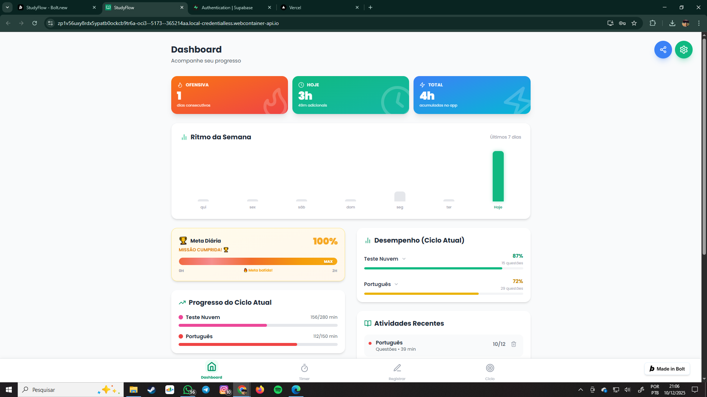
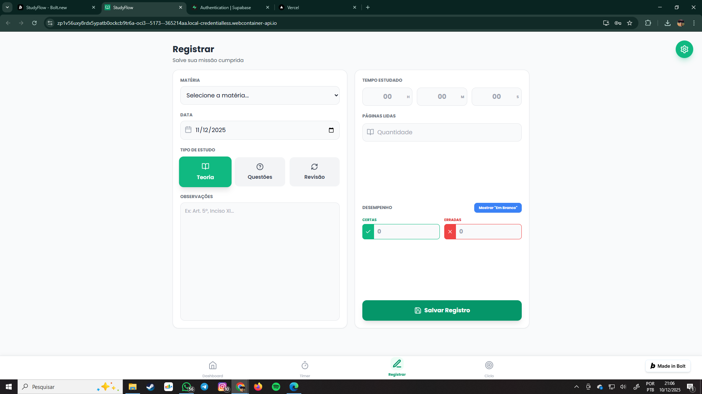
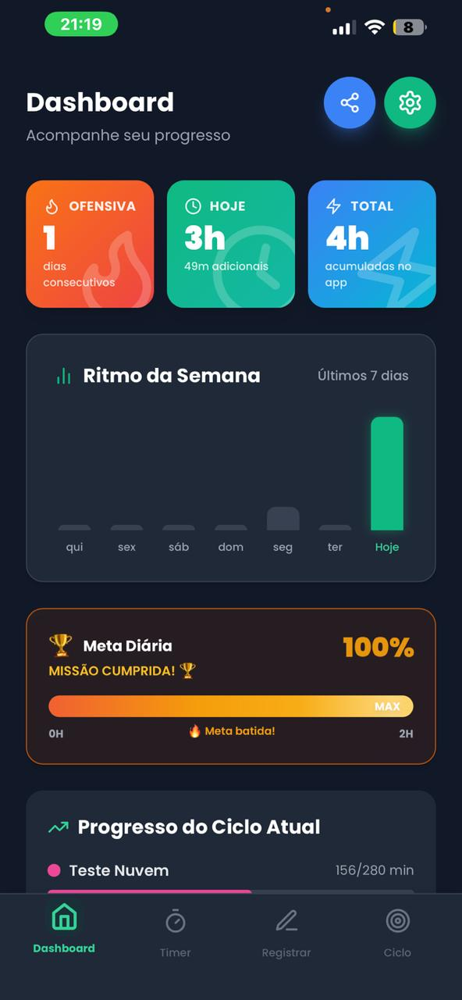

<p align="center">
  
</p>

<h1 align="center">StudyFlow</h1>

<p align="center">
  <strong>Sistema de gestão de estudos com gamificação para concurseiros</strong>
</p>

<p align="center">
  <a href="#-sobre">Sobre</a> •
  <a href="#-funcionalidades">Funcionalidades</a> •
  <a href="#-screenshots">Screenshots</a> •
  <a href="#-tecnologias">Tecnologias</a> •
  <a href="#-autor">Autor</a> •
  <a href="#-licença">Licença</a>
</p>

<p align="center">
  
  
  
  
</p>

---

## 📖 Sobre

O **StudyFlow** é uma Progressive Web App (PWA) que revoluciona a forma como concurseiros organizam seus estudos, combinando **gestão inteligente de ciclos de estudo** com um **sistema de gamificação motivacional**.

Diferente de outros apps do mercado, o StudyFlow oferece:
- 🎮 **Sistema de XP e Elos** (Bronze → Prata → Ouro → Platina → Diamante)
- 🏆 **50+ conquistas desbloqueáveis** (badges motivacionais)
- 🔥 **Sistema de ofensiva** (dias consecutivos de estudo)
- ⏱️ **Timer integrado** (Cronômetro, Temporizador e Pomodoro)
- 📊 **Análise de desempenho** por matéria e subtópico
- 📈 **Ciclo de estudos** personalizável com metas individuais

Ideal para quem se prepara para concursos públicos, vestibulares, ENEM, OAB, ou qualquer prova que exija organização e disciplina.

🔗 **Acesse o app:** [study-flow-six.vercel.app](https://study-flow-six.vercel.app/)

---

## ✨ Funcionalidades

### 📊 Dashboard Inteligente
- Estatísticas do dia (tempo, páginas, questões)
- Gráfico de barras dos últimos 7 dias
- Acompanhamento de **ofensiva** (streak de dias consecutivos)
- Meta diária com barra de progresso animada
- Progresso por matéria em tempo real
- **Desempenho em questões** (certas, erradas, em branco) com gráficos
- Histórico completo de atividades

### ⏱️ Sistema de Timer Completo
- **Cronômetro** - Para sessões livres de estudo
- **Temporizador** - Defina um tempo específico e foque
- **Modo Pomodoro** - Técnica de produtividade (25min foco + 5min pausa)
- Presets rápidos (Foco, Pausa Curta, Pausa Longa)
- Integração direta com registro de estudos

### 📝 Registro Detalhado de Estudos
- Tempo estudado (horas, minutos, segundos)
- **Tipos de estudo:** Teoria, Questões ou Revisão
- Páginas lidas (para Teoria)
- **Desempenho completo:** Questões certas, erradas e em branco
- Matérias e **subtópicos** para organização granular
- Campo de observações para anotações
- Data retroativa (registre estudos passados)

### 📚 Ciclo de Estudos Inteligente
- Cadastro de matérias com **metas individuais** (horas)
- **Subtópicos ilimitados** por matéria
- Progresso visual com barras coloridas
- **Reordenação por arrastar** (priorize matérias)
- Reinício de ciclo (zera progresso, mantém estrutura)
- Acompanhamento de conclusão de subtópicos

### 🎮 Sistema de Gamificação
- **Sistema de XP:** Ganhe pontos estudando
- **5 Elos:** Bronze → Prata → Ouro → Platina → Diamante
- **50+ Badges:** Conquistas desbloqueáveis (Maratonista, Perfeccionista, etc)
- **Ofensiva (Streak):** Dias consecutivos sem falhar
- **Sala de Troféus:** Visualize todas as suas conquistas
- **Ranking visual** com barra de progresso até o próximo elo

### 📊 Estatísticas e Análises
- Desempenho por matéria (aproveitamento de questões)
- Tempo total estudado (hoje, semana, mês, total)
- Páginas lidas acumuladas
- **Exportação de dados** em PDF (resumo completo)
- Histórico completo com filtros

### ⚙️ Configurações Personalizáveis
- **Tema claro/escuro** (modo noturno)
- **Meta diária** personalizável (0-12 horas)
- **Privacidade:** Ocultar desempenho (para quem não quer ver % de acerto)
- Alteração de senha
- Notificações (suporte PWA)
- **Factory Reset** (limpar todos os dados)

### 📱 Progressive Web App (PWA)
- **Instalável** no celular como app nativo
- Funciona **offline** (Service Worker)
- Interface **100% responsiva** (mobile e desktop)
- Notificações push (em breve)
- Carregamento instantâneo

---

## 📸 Screenshots

### Desktop

<p align="center">
  
  <br />
  <em>Dashboard com estatísticas e gráficos</em>
</p>

<p align="center">
  
  <br />
  <em>Tela de registro de estudos</em>
</p>

<p align="center">
  
  <br />
  <em>Gestão do ciclo de estudos</em>
</p>

### Mobile

<p align="center">
  
  <br />
  <em>Dashboard otimizado para mobile</em>
</p>

---

## 🛠️ Tecnologias

O projeto foi desenvolvido com as seguintes tecnologias:

### Frontend
- **[React 18](https://react.dev/)** — Biblioteca para construção de interfaces
- **[TypeScript](https://www.typescriptlang.org/)** — Tipagem estática para JavaScript
- **[Vite](https://vitejs.dev/)** — Build tool ultrarrápido (HMR instantâneo)
- **[Tailwind CSS](https://tailwindcss.com/)** — Framework CSS utilitário
- **[Framer Motion](https://www.framer.com/motion/)** — Animações fluidas e naturais
- **[Lucide React](https://lucide.dev/)** — Ícones modernos e leves

### Backend
- **[Supabase](https://supabase.com/)** — Backend as a Service
  - Autenticação (email/senha + recuperação)
  - Banco de dados PostgreSQL
  - Realtime subscriptions
  - Row Level Security (RLS)

### Infraestrutura & DevOps
- **[Vercel](https://vercel.com/)** — Deploy contínuo e hospedagem
- **[Vercel Analytics](https://vercel.com/analytics)** — Métricas de tráfego
- **[Sentry](https://sentry.io/)** — Monitoramento de erros em produção
- **[GitHub Actions](https://github.com/features/actions)** — CI/CD (testes automatizados)
- **PWA** — Progressive Web App com Service Worker

---

## 📁 Estrutura do Projeto
```
study-flow/
├── src/
│   ├── components/          # Componentes reutilizáveis
│   │   ├── AlertModal.tsx
│   │   ├── ConfirmModal.tsx
│   │   ├── SettingsModal.tsx
│   │   ├── ShareModal.tsx
│   │   ├── Toast.tsx
│   │   └── GamificationCard.tsx
│   │
│   ├── contexts/            # Context API (estado global)
│   │   └── ToastContext.tsx
│   │
│   ├── hooks/               # Hooks customizados
│   │   └── useSupabaseData.ts
│   │
│   ├── lib/                 # Configurações externas
│   │   └── supabase.ts
│   │
│   ├── pages/               # Páginas principais
│   │   ├── DashboardPage.tsx
│   │   ├── TimerPage.tsx
│   │   ├── RegisterPage.tsx
│   │   ├── CyclePage.tsx
│   │   └── GamificationPage.tsx
│   │
│   ├── types/               # Definições TypeScript
│   │   └── index.ts
│   │
│   ├── App.tsx              # Componente raiz + roteamento
│   ├── main.tsx             # Entry point
│   └── index.css            # Estilos globais + Tailwind
│
├── public/                  # Assets estáticos
│   ├── manifest.json        # Manifesto PWA
│   ├── sw.js               # Service Worker
│   └── icons/              # Ícones do PWA
│
├── docs/                    # Documentação
│   └── screenshots/        # Imagens do README
│
├── .env.example            # Template de variáveis
├── .gitignore
├── package.json
├── tsconfig.json
├── tailwind.config.js
├── vite.config.ts
├── vercel.json
└── README.md
```

## 🗺️ Roadmap

### ✅ v1.0.0 - v1.5.0 (Concluído)
- [x] Dashboard com estatísticas
- [x] Sistema de timer (Cronômetro, Temporizador, Pomodoro)
- [x] Registro completo de sessões
- [x] Gestão de matérias e subtópicos
- [x] Sistema de ciclo de estudos
- [x] Tema claro/escuro
- [x] PWA instalável
- [x] **Sistema de gamificação** (XP, elos, badges)
- [x] **Exportação de dados** (PDF)
- [x] Histórico completo de estudos
- [x] **Integração com Supabase**
- [x] **Deploy com Vercel**
- [x] **Monitoramento com Sentry**
- [x] **Vercel Analytics**

### 🚧 v1.6.0 - Janeiro 2025 (Em Desenvolvimento)
- [ ] Nova navegação mobile (BottomNav com 5 abas)
- [ ] Frase motivacional no dashboard
- [ ] Desempenho com barra colorida (verde/vermelho/azul)
- [ ] Constância visual (calendário de bolinhas)
- [ ] FAB de timer flutuante
- [ ] Toast especial ao subir de elo
- [ ] Seletor de data no registro (Hoje/Ontem/Outro)
- [ ] Botão "Salvar e criar novo" no registro
- [ ] Tamanho de fonte personalizável

### 🔮 v2.0.0 - Fevereiro 2025 (Planejado)
- [ ] Estatísticas avançadas (gráficos de evolução 30 dias)
- [ ] Heatmap de constância (calendário completo)
- [ ] Landing page pública
- [ ] Onboarding interativo (tour guiado)
- [ ] Sistema de lembretes (notificações PWA)
- [ ] Modo offline completo
- [ ] Sugestões de IA para otimizar estudos
- [ ] App mobile nativo (React Native)

### 💡 Futuro (v3.0+)
- [ ] Sistema de revisões espaçadas (Spaced Repetition)
- [ ] Simulados com correção automática
- [ ] Grupos de estudo (funcionalidade social)
- [ ] Integração com Anki
- [ ] Marketplace de ciclos de estudo

---

## 🤝 Contato e Feedback

Este é um projeto pessoal de portfólio. **Pull Requests não são aceitos** para manter a integridade autoral do código.

Entretanto, feedbacks e sugestões são bem-vindos! Se você encontrou um bug ou tem uma ideia, sinta-se à vontade para abrir uma [Issue](https://github.com/ormande/StudyFlow/issues) ou entrar em contato diretamente.

---

## 👨‍💻 Autor

<p align="center">
  
</p>

<p align="center">
  <strong>Kayke Paião Ormande da Silva</strong>
</p>

<p align="center">
  Estudante de Gestão de Tecnologia da Informação<br />
  Desenvolvedor Full Stack | Entusiasta de UX/UI
</p>

<p align="center">
  <a href="https://instagram.com/paiao.kayke">
    
  </a>
  <a href="https://github.com/ormande">
    
  </a>
  <a href="https://linkedin.com/in/kayke-paiao">
    
  </a>
</p>

---

## 📄 Licença

**Todos os direitos reservados.**

Este projeto é de propriedade exclusiva de Kayke Paião Ormande da Silva. O código-fonte é disponibilizado publicamente apenas para fins de demonstração de portfólio e aprendizado. A cópia, redistribuição ou uso comercial sem autorização expressa é proibida.

---

## 🙏 Agradecimentos

- [Supabase](https://supabase.com/) - Pela incrível plataforma de backend
- [Vercel](https://vercel.com/) - Pelo deploy e hospedagem gratuitos
- [Lucide](https://lucide.dev/) - Pelos ícones lindos e open-source
- Comunidade de concurseiros brasileiros - Pela inspiração e feedback

---

<p align="center">
  <strong>Feito com 💚, ☕ e muita disciplina por Kayke Paião</strong>
</p>

<p align="center">
  <sub>StudyFlow © 2025 - Todos os direitos reservados</sub>
</p>