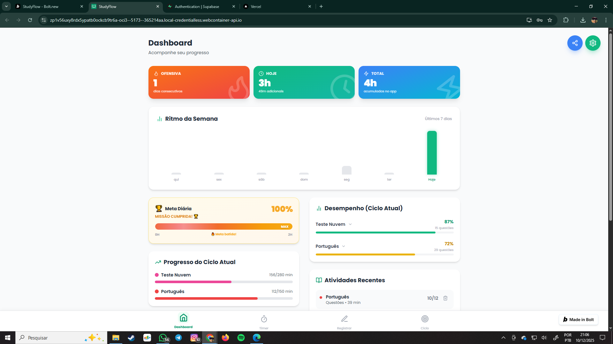
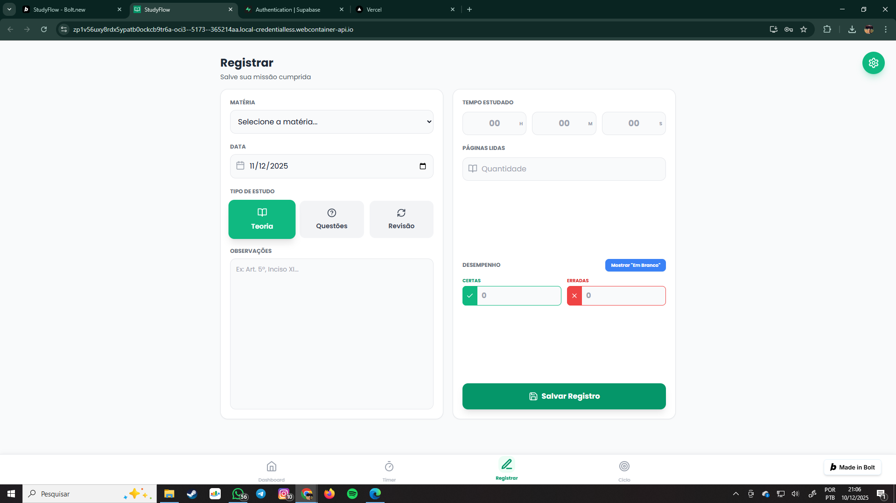
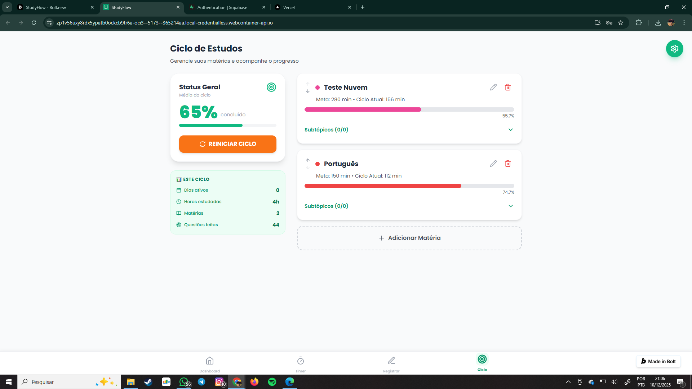
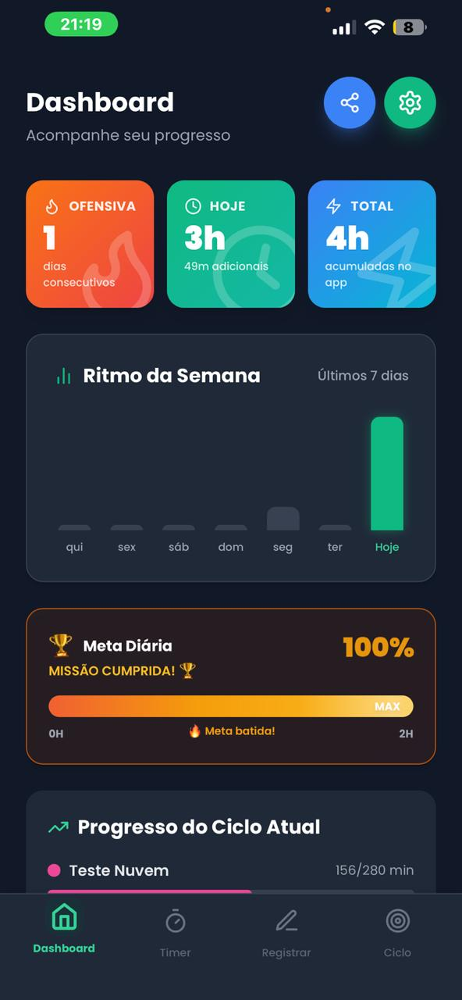

<p align="center">
  
</p>

<h1 align="center">StudyFlow</h1>

<p align="center">
  <strong>Sistema de gestão de estudos com gamificação para concurseiros</strong>
</p>

<p align="center">
  <a href="#-sobre">Sobre</a> •
  <a href="#-funcionalidades">Funcionalidades</a> •
  <a href="#-desenvolvimento-local">Desenvolvimento</a> •
  <a href="#-screenshots">Screenshots</a> •
  <a href="#-tecnologias">Tecnologias</a> •
  <a href="#-roadmap">Roadmap</a> •
  <a href="#-autor">Autor</a> •
  <a href="#-licença">Licença</a>
</p>

<p align="center">
  
  
  
  
</p>

---

## 📖 Sobre

O **StudyFlow** é uma Progressive Web App (PWA) que combina **gestão inteligente de ciclos de estudo** com um **sistema de gamificação motivacional**, voltada a quem se prepara para concursos públicos, vestibulares, ENEM, OAB e outras provas.

Principais diferenciais:

- 🎮 **Sistema de XP e Elos** (Ferro → Bronze → Prata → Ouro → Platina → Diamante → Mestre → Lenda)
- 🏆 **50+ conquistas** desbloqueáveis com resgate de recompensas
- 🔥 **Ofensiva** (dias consecutivos de estudo) e heatmap de constância
- ⏱️ **Timer integrado** (Cronômetro, Temporizador e Pomodoro)
- 📊 **Análises avançadas** por matéria, subtópico e evolução temporal
- 💳 **Assinaturas** (trial, mensal e vitalício) — pagamentos via Asaas

🔗 **App em produção:** [getstudyflow.com.br](https://getstudyflow.com.br)

📋 **Histórico de versões:** [CHANGELOG.md](./CHANGELOG.md)

---

## ✨ Funcionalidades

### 📊 Dashboard

- Estatísticas do dia (tempo, páginas, questões)
- Gráfico dos últimos 7 dias e frase motivacional diária
- Ofensiva (streak) e meta diária com barra de progresso
- Desempenho em questões com barras coloridas (certas / erradas / em branco)
- Heatmap de constância (calendário visual)
- Histórico recente e compartilhamento de progresso

### ⏱️ Timer

- **Cronômetro**, **Temporizador** e **Pomodoro** (25 min foco + pausas)
- Presets rápidos (Foco, Pausa Curta, Pausa Longa)
- FAB flutuante no mobile para acesso rápido
- Integração com registro de estudos e notificações locais ao finalizar

### 📝 Registro de Estudos

- Tempo (horas, minutos, segundos), tipo (Teoria / Questões / Revisão)
- Questões certas, erradas e em branco; páginas lidas; observações
- Matérias e subtópicos; data retroativa com seletor **Hoje / Ontem / Outro**
- **Salvar e criar novo** — salva e mantém matéria, subtópico, tipo e data para registrar o próximo bloco

### 📚 Ciclo de Estudos

- Matérias com metas individuais (horas) e subtópicos ilimitados
- Barras de progresso, reordenação por arrastar e reinício de ciclo

### 🎮 Gamificação

- XP por tempo de estudo, acertos e páginas lidas
- **8 elos** com modal celebratório ao subir de nível
- Conquistas por categoria (constância, volume, desempenho, etc.)
- Página de elos, histórico de XP e sala de troféus

### 📈 Estatísticas e Histórico

- Gráficos de evolução (últimos 30 dias), taxa de acerto e filtros por período
- Histórico com busca global no servidor, paginação e filtros por data
- Exportação de relatório em PDF

### 👤 Perfil, Planos e Autenticação

- Perfil editável (nome, foto, data de nascimento)
- Landing page pública, cadastro, login e recuperação de senha
- Planos PRO (trial, mensal, vitalício) com checkout PIX via Asaas
- Verificação de e-mail e gestão de assinatura

### ⚙️ Configurações e Aparência

- Tema claro / escuro / alto contraste
- Tamanho de fonte personalizável (pequeno, médio, grande)
- Meta diária, privacidade (ocultar desempenho), alteração de senha
- Notificações locais do navegador (timer e lembretes)
- Factory reset (apagar todos os dados)

### 📱 PWA e Mobile

- Instalável na tela inicial (`manifest.json` + ícones em `public/`)
- Interface responsiva com **BottomNav** (5 abas) e sidebar no desktop
- Safe areas para iOS (notch e barra inferior)
- Sincronização entre abas/dispositivos via Supabase Realtime

#### Status PWA (o que existe hoje)

| Recurso | Status |
|---------|--------|
| Instalar na tela inicial | ✅ Funciona |
| Layout mobile / desktop | ✅ Funciona |
| **Service Worker** (`sw.js` ou plugin PWA) | ❌ **Não existe** no repositório |
| Cache offline do app (shell + assets) | ❌ Não implementado |
| Usar o app sem internet (login, dados, salvar estudos) | ❌ Requer Supabase online |
| Notificações locais (timer / teste em Configurações) | ✅ Via `Notification` API do navegador |
| Push remoto com app fechado | ❌ Não implementado |

O hook `useNotification` tenta usar Service Worker **somente se** o navegador já tiver um registrado; o StudyFlow **não registra** nenhum SW próprio. Na prática, as notificações usam a API nativa do browser.

> **Resumo:** é um PWA **instalável**, mas **não** é um app offline completo. Modo offline está no [Roadmap](#-roadmap).

---

## 🚀 Desenvolvimento local

### Pré-requisitos

- Node.js 20+
- Conta e projeto no [Supabase](https://supabase.com/)

### Instalação

```bash
git clone https://github.com/ormande/StudyFlow.git
cd StudyFlow
npm ci
```

### Variáveis de ambiente

Copie o template e preencha com suas chaves:

```bash
cp .env.example .env
# Windows: copy .env.example .env
```

| Arquivo | Vai pro Git? | Função |
|---------|--------------|--------|
| `.env.example` | ✅ Sim | Modelo **sem segredos** — mostra quais variáveis existem |
| `.env` | ❌ Não | Suas chaves **reais** — só na sua máquina / Vercel |

Variáveis do **frontend** (arquivo `.env` na raiz — detalhes em [`.env.example`](./.env.example)):

| Variável | Obrigatória | Onde obter |
|----------|-------------|------------|
| `VITE_SUPABASE_URL` | Sim | Supabase → Settings → API |
| `VITE_SUPABASE_ANON_KEY` | Sim | Supabase → Settings → API |
| `VITE_SENTRY_DSN` | Não | Sentry → Client Keys (DSN) |

**Secrets do Supabase** (Edge Functions → Secrets — **não** vão no `.env` do Vite):

| Secret | Status / uso |
|--------|----------------|
| `SUPABASE_URL`, `SUPABASE_ANON_KEY`, `SB_SERVICE_ROLE_KEY` | Obrigatórios para as funções |
| `BREVO_API_KEY` | E-mails transacionais (opcional) |
| `TELEGRAM_BOT_TOKEN`, `ADMIN_CHAT_ID`, `FUNCTION_SECRET` | Bot de suporte (opcional) |
| `ASAAS_API_KEY`, `ASAAS_SANDBOX_API_KEY`, `ASAAS_SANDBOX`, `ASAAS_WEBHOOK_TOKEN` | Integração de pagamentos via Asaas |

> ⚠️ Nunca commite `.env` com chaves reais. O `service_role` só no Supabase, nunca no bundle do navegador.

### Scripts

| Comando | Descrição |
|---------|-----------|
| `npm run dev` | Servidor de desenvolvimento (Vite) |
| `npm run build` | Build de produção |
| `npm run preview` | Preview do build |
| `npm run typecheck` | Verificação TypeScript |
| `npm run test` | Testes (Vitest) |
| `npm run lint` | ESLint |

O CI no GitHub Actions executa `typecheck`, `test` e `build` em pushes para `main`.

---

## 📸 Screenshots

### Desktop

<p align="center">
  
  <br />
  <em>Dashboard com estatísticas e gráficos</em>
</p>

<p align="center">
  
  <br />
  <em>Tela de registro de estudos</em>
</p>

<p align="center">
  
  <br />
  <em>Gestão do ciclo de estudos</em>
</p>

### Mobile

<p align="center">
  
  <br />
  <em>Dashboard otimizado para mobile</em>
</p>

---

## 🛠️ Tecnologias

### Frontend

- **[React 18](https://react.dev/)** + **[TypeScript](https://www.typescriptlang.org/)**
- **[Vite](https://vitejs.dev/)** — build e HMR
- **[Tailwind CSS](https://tailwindcss.com/)** — estilos utilitários
- **[Framer Motion](https://www.framer.com/motion/)** — animações
- **[Recharts](https://recharts.org/)** — gráficos
- **[jsPDF](https://github.com/parallax/jsPDF)** — exportação PDF
- **[Lucide React](https://lucide.dev/)** — ícones

### Backend e pagamentos

- **[Supabase](https://supabase.com/)** — auth, PostgreSQL, Storage, RLS, Edge Functions
- **Asaas** — PIX e assinaturas (`supabase/functions/pix-create`, `asaas-webhook`, `asaas-polling`)

### Infraestrutura

- **[Vercel](https://vercel.com/)** — hospedagem e deploy contínuo
- **[Vercel Analytics](https://vercel.com/analytics)** — métricas
- **[Sentry](https://sentry.io/)** — monitoramento de erros (produção)
- **[GitHub Actions](https://github.com/features/actions)** — CI (typecheck + build)
- **Brevo** — e-mails transacionais (confirmação, recuperação, pós-compra)

---

## 📁 Estrutura do Projeto

```
StudyFlow/
├── src/
│   ├── components/       # UI reutilizável (Button, BottomNav, modais, etc.)
│   ├── contexts/         # Toast, XP, Conquistas
│   ├── hooks/            # Dados Supabase, gamificação, metas, aparência
│   ├── pages/            # Telas (Dashboard, Timer, Stats, Profile, …)
│   ├── lib/              # Cliente Supabase
│   ├── types/            # Tipos TypeScript
│   ├── data/             # Frases motivacionais, etc.
│   ├── utils/            # Datas, PDF, animações
│   ├── App.tsx           # Auth, landing e roteamento público
│   └── main.tsx          # Entry point + Sentry
│
├── public/
│   ├── manifest.json     # Manifesto PWA
│   ├── icon-192.png
│   └── icon-512.png
│
├── supabase/
│   ├── functions/        # Edge Functions (PIX, webhooks Efi, cupons, …)
│   └── config.toml
│
├── supabase_migrations/  # Schema SQL
├── backup-scripts/       # Backup manual do banco
├── docs/screenshots/     # Imagens do README
├── .github/workflows/    # CI
├── .env.example          # Template de variáveis (sem segredos)
├── CHANGELOG.md
└── README.md
```

---

## 🗺️ Roadmap

O roadmap reflete o estado do repositório em **v1.10.0**. Detalhes por versão estão no [CHANGELOG.md](./CHANGELOG.md).

### ✅ Concluído (v1.0 – v1.9)

- [x] Dashboard, timer, registro, ciclo e gamificação (XP, elos, conquistas)
- [x] Histórico com busca server-side, paginação e exportação PDF
- [x] Integração Supabase, deploy Vercel, Sentry e Analytics
- [x] Navegação mobile (BottomNav), FAB do timer, heatmap de constância
- [x] Frase motivacional, barras de desempenho coloridas, seletor de data (Hoje/Ontem/Outro)
- [x] Modal de subida de elo, tamanho de fonte e temas (claro/escuro/alto contraste)
- [x] Estatísticas avançadas (evolução 30 dias, taxa de acerto)
- [x] Landing page, perfil editável, welcome modal e tutorial estático
- [x] Monetização (trial, mensal, vitalício) e pagamentos Efi
- [x] Notificações locais do navegador (timer e configurações)

### 🚧 Em andamento / polish

- [x] **Pagamentos:** migração de gateway **Efí Bank → Asaas** (PIX, webhook e polling)
- [x] Botão **“Salvar e criar novo”** no registro de estudos
- [ ] Service Worker e modo offline completo
- [ ] Push notifications remotas (background)
- [x] Testes automatizados de XP alinhados com a lógica oficial
- [x] Link de edição de perfil na página “Mais” → `ProfilePage`

### 🔮 Planejado (v2.0+)

- [ ] Onboarding interativo (tour guiado)
- [ ] Sugestões de IA para otimizar estudos
- [ ] App mobile nativo (React Native)

### 💡 Futuro (v3.0+)

- [ ] Revisão espaçada (Spaced Repetition)
- [ ] Simulados com correção automática
- [ ] Grupos de estudo (social)
- [ ] Integração com Anki
- [ ] Marketplace de ciclos de estudo

---

## 🤝 Contato e Feedback

Este é um projeto pessoal de portfólio e produto comercial. **Pull Requests não são aceitos** para manter a integridade autoral do código.

Feedbacks e reportes de bug são bem-vindos via [Issues](https://github.com/ormande/StudyFlow/issues) ou contato direto.

---

## 👨‍💻 Autor

<p align="center">
  
</p>

<p align="center">
  <strong>Kayke Paião Ormande da Silva</strong>
</p>

<p align="center">
  Estudante de Gestão de Tecnologia da Informação<br />
  Desenvolvedor Full Stack | Entusiasta de UX/UI
</p>

<p align="center">
  <a href="https://instagram.com/oficial.studyflow">
    
  </a>
  <a href="https://github.com/ormande">
    
  </a>
  <a href="https://linkedin.com/in/kayke-paiao">
    
  </a>
</p>

---

## 📄 Licença

**Todos os direitos reservados.**

Este projeto é de propriedade exclusiva de Kayke Paião Ormande da Silva. O código-fonte é disponibilizado publicamente apenas para fins de demonstração de portfólio e aprendizado. A cópia, redistribuição ou uso comercial sem autorização expressa é proibida.

---

## 🙏 Agradecimentos

- [Supabase](https://supabase.com/) — backend e autenticação
- [Vercel](https://vercel.com/) — deploy e hospedagem
- [Lucide](https://lucide.dev/) — ícones open-source
- Comunidade de concurseiros brasileiros — inspiração e feedback

---

<p align="center">
  <strong>Feito com 💚, ☕ e muita disciplina por Kayke Paião</strong>
</p>

<p align="center">
  <sub>StudyFlow © 2026 — Todos os direitos reservados</sub>
</p>
